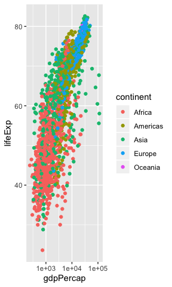

# Introduction

Here is my first rmd document

# Let's embed some r code

We'll write an R chunk that loads the tidyverse package and then reads in the Gapminder data set from the data subdirectory of the project

CMD + OPT + i
CNTRL + ALT + i to insert new r chunk

```r
library(tidyverse)
gm <- read_csv("Data/gapminder.csv")
```

# Investigate gm data

Let's take a look at the gm


```r
head(gm)
```

```
## # A tibble: 6 x 6
##   country     continent  year lifeExp      pop gdpPercap
##   <chr>       <chr>     <dbl>   <dbl>    <dbl>     <dbl>
## 1 Afghanistan Asia       1952    28.8  8425333      779.
## 2 Afghanistan Asia       1957    30.3  9240934      821.
## 3 Afghanistan Asia       1962    32.0 10267083      853.
## 4 Afghanistan Asia       1967    34.0 11537966      836.
## 5 Afghanistan Asia       1972    36.1 13079460      740.
## 6 Afghanistan Asia       1977    38.4 14880372      786.
```

# Our first plot

Showing gdp per captia on x and life expectancy on y


```r
ggplot(gm, aes(x = gdpPercap, y = lifeExp)) + geom_point()
```


# A better plot


```r
ggplot(gm, aes(x = gdpPercap, y = lifeExp)) + 
  geom_point(aes(col = continent)) +
  scale_x_log10()
```



# Possible chunk options

Options include:
- echo (TRUE by default) whether to include code in output
- results 
  - hide will hide the results
  - hold will hold results until end of r chunk
- include (TRUE by default) if FALSE then the code will not be run
- fig.width, fig.height set the figure dimensions in the output
- cache (FALSE by default) if TRUE saves result from R chunk

# Table in RMarkdown

See some data using head


```r
head(gm)
```

```
## # A tibble: 6 x 6
##   country     continent  year lifeExp      pop gdpPercap
##   <chr>       <chr>     <dbl>   <dbl>    <dbl>     <dbl>
## 1 Afghanistan Asia       1952    28.8  8425333      779.
## 2 Afghanistan Asia       1957    30.3  9240934      821.
## 3 Afghanistan Asia       1962    32.0 10267083      853.
## 4 Afghanistan Asia       1967    34.0 11537966      836.
## 5 Afghanistan Asia       1972    36.1 13079460      740.
## 6 Afghanistan Asia       1977    38.4 14880372      786.
```

now head function as a nicely formatted table


```r
library(knitr)
kable(head(gm))
```


country       continent    year   lifeExp        pop   gdpPercap
------------  ----------  -----  --------  ---------  ----------
Afghanistan   Asia         1952    28.801    8425333    779.4453
Afghanistan   Asia         1957    30.332    9240934    820.8530
Afghanistan   Asia         1962    31.997   10267083    853.1007
Afghanistan   Asia         1967    34.020   11537966    836.1971
Afghanistan   Asia         1972    36.088   13079460    739.9811
Afghanistan   Asia         1977    38.438   14880372    786.1134

If you like tables, look at **gt** table package
